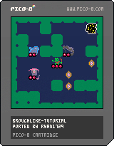

# Broughlike Tutorial Ports

This repo consists of ports of the code from [this excellent tutorial](https://github.com/nluqo/broughlike-tutorial) to different languages/platforms, from the original browser-based JS version. Note that the actual instructions aren't redone; only the code has been ported.

## js-original

A completed version of the code from the [original tutorial](https://github.com/nluqo/broughlike-tutorial).

## pico8

A version of the code for the [pico-8 fantasy console](https://www.lexaloffle.com/pico-8.php).

[Web Version](https://ryan1729.github.io/broughlike-tutorial-ports/pico-8.html)

## dragonruby

A version of the code for the [DragonRuby game engine](https://dragonruby.itch.io/dragonruby-gtk).

[Web Version](https://ryan1729.github.io/broughlike-tutorial-ports/dragonruby/index.html)

## go

A version of the code for the [go programming language](https://golang.org/).

(Desktop Binary only)

## elm

A version of the code for the [elm programming language](https://elm-lang.org/).

[Web Version](https://ryan1729.github.io/broughlike-tutorial-ports/elm/index.html)

## nim

A version of the code for the [nim programming language](https://nim-lang.org/).

(Desktop Binary only)
